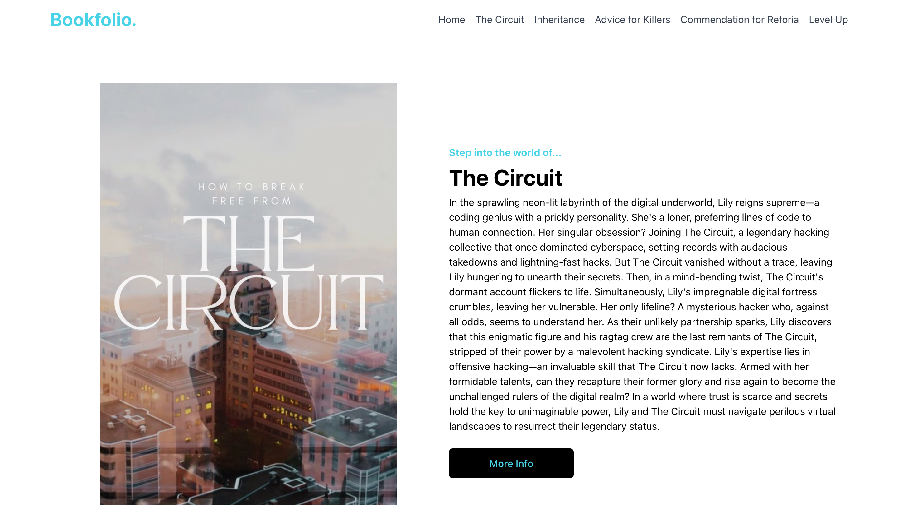

# Bookfolio

## Table of Contents
- [Description](#description)
- [Installation](#installation)
- [Usage](#usage)
- [Contributions](#contributions)
- [Test](#test)
- [Contact](#contact)
- [License](#license)

## Description
Bookfolio is the perfect platform for authors to showcase their literary creations and connect with readers. With Bookfolio, you can create stunning book profiles, share exciting updates about your work, and encourage readers to visit your landing pages where they can purchase your books.

## Installation & Usage

See [this link](https://sarahgjacobs.github.io/bookfolio/) to view the page.

## Contributions
Sarah Jacobs

## Test
N/A

## Contact
For more information please contact: [sgjacobs14@gmail.com](mailto:sgjacobs14@gmail.com)
Or visit my GitHub page at: [sarahgjacobs]

## License 
    This software is licensed under MIT License

